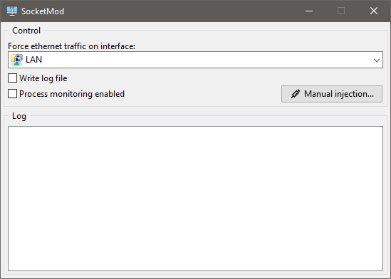

# SocketMod

SocketMod is a tool to modify Winsock calls. Currently the only thing it can do is modify results of gethostbyname() which can be helpful to get some LAN multiplayer games working on computers with multiple ethernet interfaces (i.e. play LAN games using a VPN tunnel).

  

### Features
- Modify results of gethostbyname() to a single user supplied IP address
- Built using Lazarus :fire:

### How to use
Download, extract, and run it. Select the preferred network interface, then check "Process monitoring enabled" to automatically inject into fullscreen applications or use the button "Manual injection..." to modify any process.

### Building
Install Lazarus IDE and the tools to crosscompile, open any project file and build it. To use the build script "Build.bat" you need to edit its 4th line.

### Thanks
- [Lazarus IDE](https://www.lazarus-ide.org)
- [Free Pascal](https://www.freepascal.org)
- Application icon made by [Freepik](https://www.freepik.com) from [Flaticon](https://www.flaticon.com)
- [MahdiSafsafi](https://github.com/MahdiSafsafi)